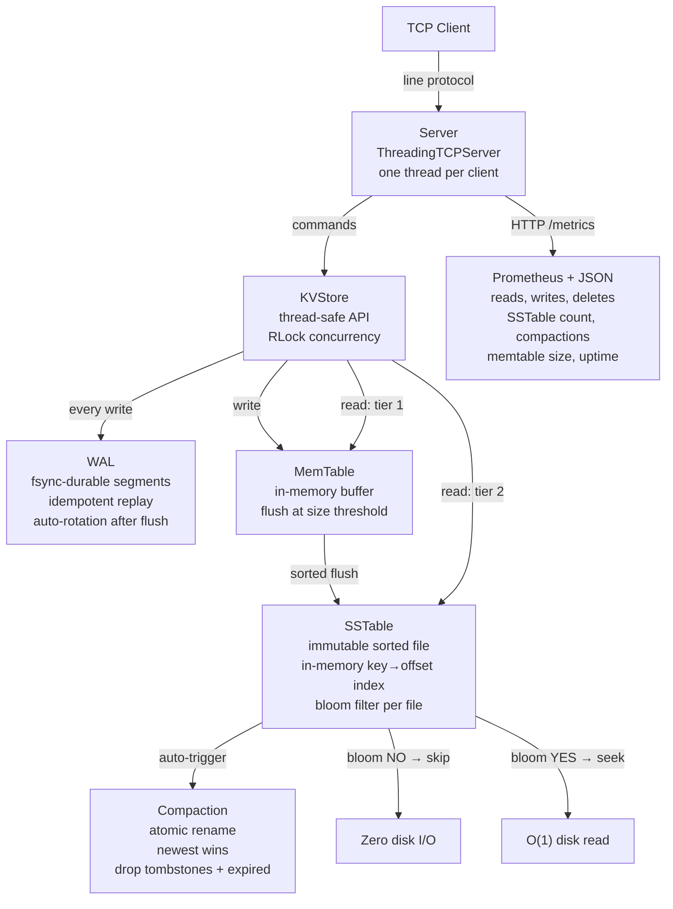

# KV Store


A storage engine built from scratch in Python — not a wrapper around an existing database.
Implements the LSM-tree architecture used by LevelDB, RocksDB, and Cassandra:
write-ahead log, memtable, sorted string tables, bloom filters, and compaction.

Every component is wired end-to-end: writes flow through the WAL into the MemTable,
flush to SSTables when full, and reads fall back through each tier with bloom-filter gating.
This is not a collection of standalone modules — it is a working storage engine.

**70 tests** — property-based (Hypothesis), crash-recovery, concurrency stress, and unit.

---

## Architecture



---

## Write Path

Every `SET` or `DELETE`:

1. **WAL append + fsync** — the record hits the physical disk before anything else happens.
   Each entry carries an integer `op_id` and an absolute `expiry` timestamp.
   `sync_every` controls the durability/throughput knob (1 = fsync per write, N = batched).
2. **MemTable insert** — the in-memory sorted buffer. Reads hit this first, so hot keys never touch disk.
3. **Flush** — when the MemTable exceeds its size threshold, it is marked immutable under a short lock,
   a fresh MemTable takes its place, and the immutable one is written to a new SSTable **outside the lock**
   (so reads/writes are not blocked during disk I/O).
4. **WAL rotation** — once the SSTable is durably on disk, the old WAL segment is deleted.
   Replay on restart only processes un-flushed data, keeping recovery time bounded.
5. **Auto-compaction** — if the SSTable count exceeds the trigger threshold, a size-tiered
   compaction merges all SSTables into one via crash-safe atomic rename.

## Read Path

`GET` checks each tier in order — **first definitive answer wins**:

1. **Live MemTable** — O(1) dict lookup.
2. **Immutable MemTable** (if a flush is in progress).
3. **SSTables, newest to oldest** — for each:
   - **Bloom filter** says NO → skip entirely, zero disk I/O (guaranteed absent).
   - **Bloom filter** says YES → check in-memory `{key: byte_offset}` index → single `seek()` + `readline()`.
4. A **tombstone** (delete marker) in any tier is a definitive "key does not exist" — it stops the scan
   and prevents older values from resurfacing. This is the correctness invariant that makes LSM deletes work.

## Range Scans

`SCAN start end` returns all live keys in `[start, end]` in sorted order by merging across
all tiers (oldest SSTables first, newest MemTable last — newer values overwrite older ones).
Tombstones and expired keys are excluded from the result.

---

## Crash Safety

### WAL durability

- `os.fsync()` after every flush — data survives power loss, not just process crashes.
- Torn writes (partial JSON from a mid-write crash) are detected and skipped during replay.
- Idempotent replay via `op_id` — replaying the same WAL twice produces the same state.
- Absolute expiry timestamps — a key set with `ttl=300` at 9:00am stores `expiry=1699999800.0`.
  If the server restarts at 9:04am, the key is restored with 1 minute remaining, not 5.

### Crash-safe flush and compaction

Both SSTable flush and compaction use the atomic rename pattern:

1. Write to a `.tmp` file.
2. `flush()` + `os.fsync()` — bytes are on physical disk.
3. `os.replace(tmp, final)` — atomic on the filesystem. Either the old file exists or the new one does. Never a half-written file.
4. Delete source SSTables only **after** the new file is durable.

On startup, stale `.tmp` files (evidence of a crash mid-write) are cleaned up automatically.

### Proven by test

`test_crash_recovery.py` does what most student projects skip:
- Writes data, does **not** call `close()` (simulating `kill -9`), reopens, and verifies every key.
- Appends a torn JSON record to the WAL and verifies it is skipped while prior records replay.
- Writes enough data to trigger flush + WAL rotation, then restarts and verifies data survives
  via SSTable even though the WAL segment was deleted.

---

## Performance

Benchmarked on a standard laptop (Python 3.8, Windows 11, AMD Ryzen):

| Operation | Ops/sec | Notes |
|---|---|---|
| Write (no WAL) | ~61,000 | MemTable + flush to SSTable |
| Write (WAL, sync_every=100) | ~26,000 | Batched fsync — 100 writes per syscall |
| Write (WAL, sync_every=1) | ~600 | fsync per write — maximum durability |
| Read (in-memory) | ~8,000 | MemTable hit, no disk fallback |
| Read latency | 0.12 ms avg | |
| C++ unordered_map read | ~29M | ~25x faster than Python |

**Durability costs throughput.** `sync_every=1` (fsync per write) is ~43x slower than batched mode.
This is the fundamental tradeoff every storage engine makes — and `sync_every` is how this engine
exposes it as a tunable. The algorithm is already optimal; Python's interpreter and GC overhead
cap throughput ~25x below a C++ baseline.

**Methodology:** `time.perf_counter()` timing, `tracemalloc` for memory.
Run: `python -m benchmarks.benchmark`

---

## Bloom Filter

Each SSTable builds a bloom filter at construction, sized for its key count at a 1% target
false-positive rate using the optimal formulas:

- **Bit array size:** `m = -n * ln(p) / (ln2)^2`
- **Hash count:** `k = (m / n) * ln2`

False negatives are impossible — if a key is in the SSTable, the bloom filter always says YES.
False positives (bloom says YES but the key isn't there) trigger one unnecessary disk seek,
bounded to ~1% of queries. This is verified by test: 10,000 inserted keys, 50,000 absent keys,
observed FP rate asserted under 2%.

---

## Observability

`/metrics` endpoint serves both JSON (default) and Prometheus text format (content-negotiated via `Accept` header).

**Counters:** `kvstore_reads_total`, `kvstore_writes_total`, `kvstore_deletes_total`, `kvstore_compactions_total`, `kvstore_corrupt_records_total`

**Gauges:** `kvstore_key_count`, `kvstore_memtable_size_bytes`, `kvstore_sstable_count`, `kvstore_wal_segment_count`, `kvstore_uptime_seconds`

**Timers:** `kvstore_compaction_seconds_total`

```bash
# JSON
curl http://127.0.0.1:6380/metrics

# Prometheus format
curl -H "Accept: text/plain" http://127.0.0.1:6380/metrics
```

A `prometheus.yml` scrape config is included. Add Prometheus + Grafana to `docker-compose.yml`
to get live dashboards for throughput, SSTable count, and compaction duration.

---

## Features

| Feature | Detail |
|---|---|
| GET / SET / DELETE / INCR | Core operations, O(1) average via MemTable |
| SCAN | Sorted range query across all tiers via k-way merge |
| TTL (key expiry) | Lazy eviction — absolute timestamps, checked on access |
| Write-Ahead Log | fsync-durable, segmented, auto-rotating after flush |
| MemTable | In-memory write buffer, flushed to SSTable at size threshold |
| SSTable | Immutable sorted files, in-memory `{key: offset}` index, O(1) seek |
| Bloom Filter | Per-SSTable, 1% FP target, eliminates disk reads on misses |
| Compaction | Automatic, crash-safe (atomic rename), size-tiered trigger |
| Crash recovery | Proven: WAL fsync + idempotent replay + atomic flush |
| Prometheus metrics | Counters, gauges, timers — JSON and text format |
| TCP server | Multi-client, one thread per connection |
| Line protocol | Redis-inspired: `+OK`, `+value`, `:integer`, `$-1`, `-ERR` |
| Session store | JSON-encoded sessions with TTL auto-expiry |
| Rate limiter | Fixed-window counter — O(1), auto-resets each window |
| Graceful shutdown | SIGINT / SIGTERM → flush WAL → close cleanly |
| Docker | One-command deploy via docker compose |
| CI | GitHub Actions — 70 tests on every push |

---

## Design Decisions

**Why LSM-tree over B-tree?**
LSM writes are sequential (append-only) — faster on both HDD and SSD.
B-trees do random writes (update in place), giving better read performance but slower writes.
LSM trades read amplification (checking multiple SSTables per miss) for write throughput.
Compaction reduces read amplification by merging SSTables.

**Why fsync and not just flush?**
`file.flush()` pushes Python's buffer into the OS kernel. But the OS can hold data in RAM
for seconds before writing to disk. `os.fsync()` forces the kernel to write to physical media.
Without fsync, a power failure loses every write since the last OS-initiated flush —
which could be seconds of data. fsync is expensive (~43x throughput cost in benchmarks),
which is why `sync_every` exists as a tunable.

**Why WAL segments instead of a single file?**
A single WAL file grows without bound — replay gets slower on every restart.
Segmented WAL deletes obsolete segments after their data is durably in SSTables,
keeping replay time proportional to un-flushed data only.

**Why atomic rename for flush and compaction?**
Writing directly to the final path means a crash mid-write leaves a corrupt file.
The `tmp → fsync → os.replace` pattern guarantees either the old file or the new file
exists — never a partial write. `os.replace` is atomic on both POSIX and Windows (NTFS).

**Why tombstones stop the read scan?**
A delete writes a tombstone marker to the MemTable. When reading, if tier N has a tombstone
for a key, the scan stops — even if tier N+1 has a value. Without this, deleting a key
would "undelete" it when the MemTable flushes and the older SSTable value becomes visible.

**Why lazy TTL eviction?**
A background scanner adds complexity and competes for CPU. Lazy eviction costs one timestamp
comparison per access and is zero-cost for keys that are never accessed again.
Redis uses the same strategy by default.

**Why fixed-window rate limiter over sliding window?**
Fixed window is O(1) — one key per user per window, auto-expires via TTL.
Sliding window stores a timestamp list per user — O(n) cleanup per request.
The tradeoff: a burst of 2x the limit is possible across a window boundary.
For most use cases, fixed window is the right default.

**Limitations (intentional scope boundaries):**
- Single-node only — no replication or distribution (that's a different project)
- SSTable reads open a file handle per lookup — a production engine would use a block cache
- `INCR` resets TTL — preserving expiry across tiers would require a richer get() return type
- Compaction runs inline after flush, not in a background thread — simpler and deterministic

---

## Test Suite

70 tests across 14 test files:

| Category | Tests | What they prove |
|---|---|---|
| **Crash recovery** | 4 | WAL replay after kill -9, torn writes skipped, rotation + restart |
| **Property-based** | 2 | Random op sequences match a dict oracle (Hypothesis) |
| **Concurrency** | 4 | Multi-threaded set/get/delete/scan — no crashes, no lost writes |
| **LSM engine** | 7 | Flush to SSTable, read-back, tombstone masking, restart reload, auto-compaction |
| **Compaction** | 7 | Newest wins, tombstones removed, expired dropped, crash-safe atomic rename |
| **Range scan** | 5 | Bounds, cross-tier merge, tombstone exclusion, empty range |
| **WAL** | 5 | Recovery, delete survival, expiry, corrupt lines, idempotent replay |
| **Store** | 11 | CRUD, TTL, INCR, concurrent reads/writes |
| **Bloom filter** | 5 | No false negatives, FP rate verified under 1% target |
| **Metrics** | 2 | Counter increments, Prometheus text format |
| **Config** | 5 | Typed validation, derived paths, env-var loading |
| **Durability** | 3 | Atomic write, no leftover .tmp, overwrite correctness |
| **Rate limiter** | 5 | Allows, blocks, remaining count, independent users, window reset |
| **SSTable** | 5 | Flush/get, tombstone, expiry, index, persistence |

Run: `pytest tests/ -v`

---

## Running

**Local:**
```bash
python -m server.server       # terminal 1
python -m server.client       # terminal 2
```

**Docker:**
```bash
docker compose up --build     # terminal 1
python -m server.client       # terminal 2
```

**Commands:**
```
SET name Alice
GET name
SET session abc EX 30
INCR counter
SCAN a m
KEYS
DELETE name
quit
```

**Metrics:**
```bash
curl http://127.0.0.1:6380/metrics
curl -H "Accept: text/plain" http://127.0.0.1:6380/metrics   # Prometheus format
```

**Benchmarks:**
```bash
python -m benchmarks.benchmark
```

**Tests:**
```bash
pip install hypothesis    # dev dependency for property-based tests
pytest tests/ -v
```

---

## Project Structure

```
kv_store/
├── config.py                # Typed Config dataclass — env-var overridable, validated at boot
├── conftest.py              # pytest path setup
├── core/
│   ├── store.py             # KVStore — LSM read/write path, flush, auto-compaction
│   ├── wal.py               # WAL — fsync-durable segments, rotation, idempotent replay
│   ├── memtable.py          # MemTable — in-memory sorted buffer, size-tracked
│   ├── sstable.py           # SSTable — sorted disk file, bloom filter, O(1) index, range scan
│   ├── compaction.py        # Crash-safe merge — atomic rename, drop tombstones + expired
│   ├── bloom_filter.py      # Bloom filter — optimal sizing, SHA-256 hashing
│   ├── metrics.py           # Counters/gauges/timers — JSON + Prometheus text format
│   ├── durability.py        # atomic_write helper — tmp → fsync → os.replace
│   └── errors.py            # Exception hierarchy — CorruptRecordError, WALError, CompactionError
├── server/
│   ├── server.py            # TCP server + content-negotiated /metrics HTTP server
│   ├── protocol.py          # Line protocol — parse, ok, value, integer, error, multi_value
│   └── client.py            # Interactive CLI client
├── features/
│   ├── session_store.py     # TTL-based session management
│   └── rate_limiter.py      # Fixed-window rate limiter — O(1)
├── tests/                   # 70 tests — crash recovery, property-based, concurrency, unit
├── benchmarks/
│   └── benchmark.py         # Throughput + fsync cost + memory benchmarks
├── cpp/
│   └── benchmark.cpp        # C++ unordered_map comparison
├── prometheus.yml           # Scrape config for Prometheus
├── Dockerfile
├── docker-compose.yml
└── data/                    # Runtime — gitignored
    ├── wal/                 # WAL segments
    └── sst/                 # SSTable files
```

---

## Stack

- **Python 3.8+** — standard library only (no runtime dependencies)
- **pytest + Hypothesis** — 70 tests including property-based and concurrency
- **GitHub Actions** — CI on every push
- **Docker** — containerized deployment
- **C++ 17** — standalone benchmark for cross-language comparison
