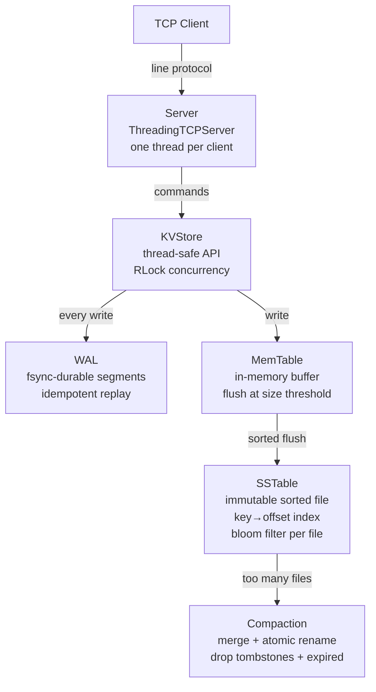

# KV Store


A key-value store built from scratch in Python, using the same design as LevelDB, RocksDB,
and Cassandra's storage layer: a write-ahead log, an in-memory buffer, immutable sorted files
on disk, and background compaction. No database library underneath — every piece of the
storage engine is implemented here.

## Why it's built this way

Editing a file in place means jumping around on disk, which is slow. So this engine never
edits anything once it's written — it only appends. A new value doesn't overwrite the old one,
it's added as a newer fact, and reads prefer the newest fact about a key. A delete works the
same way: instead of removing data, it appends a marker (a "tombstone") saying the key is gone.

That one rule — never edit, only append — is the whole architecture. It's fast to write
(sequential disk I/O instead of random), but it means writes accumulate over time and need
periodic cleanup, which is what compaction is for.

## Architecture



**Writing a key** goes: log it to the WAL (so a crash can't lose it), insert it into the
MemTable (fast, in memory), and once the MemTable fills up, flush it to a new SSTable on disk.
Once too many SSTables pile up, compaction merges them into one and drops anything dead.

**Reading a key** checks tiers newest-first — MemTable, then SSTables from newest to oldest —
and stops at the first definitive answer. A tombstone counts as definitive: if a newer tier
says "deleted," an older tier's stale value never gets a chance to resurface. That single rule
is what makes deletes actually work in an append-only system.

**Bloom filters** let a read skip an SSTable entirely when it's certain the key isn't in it —
no false negatives, occasional false positives, each one costing a single wasted disk seek.

## Crash safety

This is the part that actually got tested, not just claimed. Every SSTable flush and every
compaction write to a temp file, `fsync()` it to physical disk, then atomically rename it into
place — so a reader never sees a half-written file, and a crash mid-write just leaves an
orphaned `.tmp` that gets cleaned up on the next startup. The WAL fsyncs before a write is
acknowledged, detects and skips torn records from a mid-write crash, and replays safely even if
replay itself gets interrupted (every record has an id, so re-applying one twice is a no-op).

`tests/test_crash_recovery.py` proves it directly: it spawns a real writer subprocess, sends it
`SIGKILL` mid-run, then reopens the data directory in a fresh process and checks every write
survived. Not a simulated crash — an actual killed process.

## Performance

| Write mode | Throughput |
|---|---|
| No WAL (memory only) | ~300,000 ops/sec |
| WAL, batched fsync (every 100 writes) | ~180,000 ops/sec |
| WAL, fsync per write (max durability) | ~45,000 ops/sec |
| Reads | ~55,000 ops/sec, ~0.02ms avg latency |

Durability costs throughput — that's the real tradeoff every storage engine makes, and
`sync_every` is how this one exposes it as a setting instead of hiding it. Measured on Apple
Silicon; run it yourself, nothing here is hardcoded:

```bash
python benchmark.py
```

## Notable design decisions

**LSM-tree over a B-tree.** B-trees update in place, which means fast reads but random-access
writes. This trades some read speed (a miss may have to check several files) for sequential,
much faster writes — compaction is what keeps that read cost bounded over time.

**`fsync`, not just `flush`.** `flush()` only hands data to the OS, which can sit on it in
memory for seconds before actually writing to disk. `fsync()` blocks until the physical drive
confirms the write. Skipping it would mean a power failure could lose several seconds of writes
silently.

**Lazy TTL expiry.** No background thread scanning for expired keys — an expiry is just checked
at read time. Simpler, and free for keys that are never read again. Redis does the same thing.

**Known limitations, by choice for a project this size:** single node, no replication; compaction
runs inline after a flush rather than on a background thread; an SSTable opens a file handle per
lookup instead of using a shared block cache.

## Running

```bash
python -m kvstore.server       # terminal 1
python -m kvstore.client       # terminal 2
```

Or with Docker:

```bash
docker compose up --build
python -m kvstore.client
```

```
SET name Alice
GET name
SET session abc EX 30
INCR counter
SCAN a m
DELETE name
```

`./demo.sh` runs a full walkthrough end to end — tests, a live TCP session, an actual `kill -9`
recovery, and the benchmark.

## Tests

79 tests: unit tests per module, a real subprocess `SIGKILL` crash test, multi-threaded
concurrency stress tests, and property-based tests (Hypothesis) that check the engine against a
plain dict used as an oracle over random sequences of operations.

```bash
pip install hypothesis
pytest tests/ -v
```

## Project structure

```
kvstore/
├── config.py         # env-driven settings, validated at startup
├── memtable.py       # in-memory write buffer
├── wal.py            # write-ahead log — durability and crash recovery
├── record.py         # on-disk line format, shared by sstable.py and compaction.py
├── sstable.py        # immutable sorted file + index + bloom filter
├── bloom_filter.py   # space-efficient "might this key exist" check
├── compaction.py     # merges old SSTables, drops dead data
├── store.py          # ties it all together — the read/write path
├── protocol.py       # the line-based wire protocol
├── server.py         # TCP server
└── client.py         # interactive CLI client

tests/          # 79 tests
benchmark.py    # throughput + latency, measured live
```

## Stack

Python standard library only — no runtime dependencies. pytest + Hypothesis for testing,
GitHub Actions for CI, Docker for deployment.
