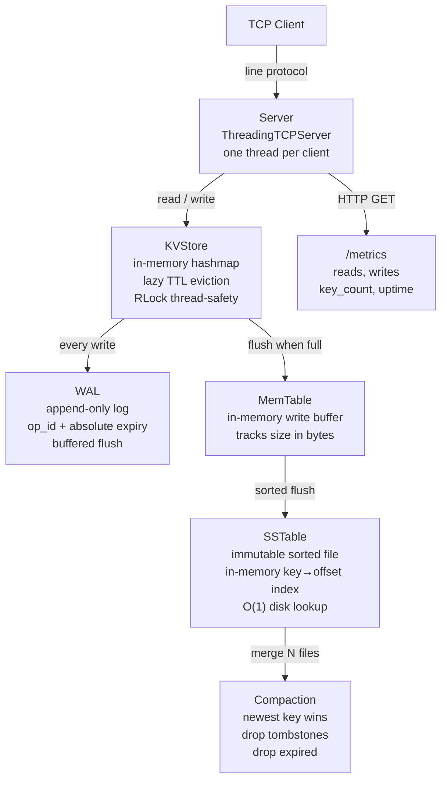
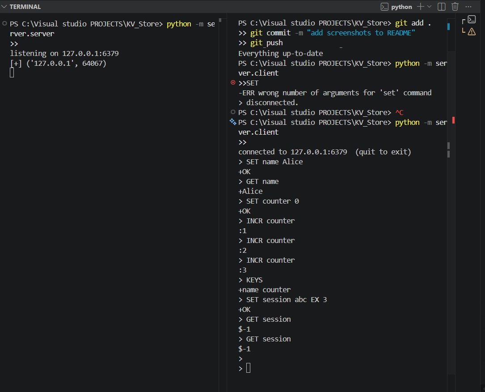
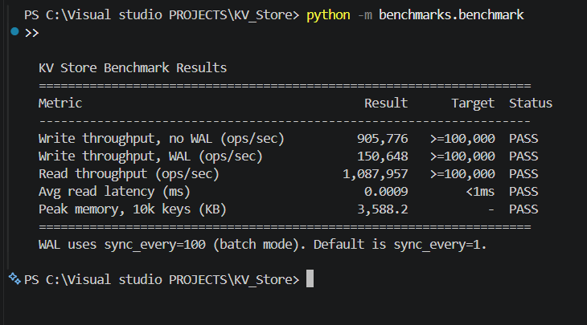
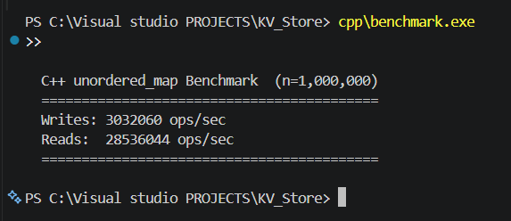

# KV Store


A custom key-value storage engine built from scratch in Python.
Implements core ideas behind Redis and LevelDB: in-memory hashmap, Write-Ahead Log,
LSM-tree persistence, and a line-protocol TCP server.

Built as an educational systems engineering project to understand how storage engines work internally.

---

## Architecture



---

## Problem

Key-value stores are the backbone of backend infrastructure — session caches, rate limiters,
feature flags, leaderboards. Understanding how they work internally means understanding:

- why writes are fast (append-only log, in-memory buffer)
- how data survives crashes (WAL replay)
- why reads get slower over time without compaction
- what "durability" actually costs in throughput

This project implements those ideas directly, without abstractions.

---

## Features

| Feature | Detail |
|---|---|
| GET / SET / DELETE / INCR | Core operations, O(1) average |
| TTL (key expiry) | Lazy eviction — checked on access, no background scanner |
| Write-Ahead Log | Crash recovery with idempotent replay via integer op IDs |
| TCP server | Multi-client, one thread per connection |
| Line protocol | Redis-inspired: `+OK`, `+value`, `:integer`, `$-1`, `-ERR` |
| Session store | JSON-encoded sessions with TTL auto-expiry |
| Rate limiter | Fixed-window counter — O(1), auto-resets each window |
| MemTable | In-memory write buffer, flushed to disk when size threshold is reached |
| SSTable | Immutable sorted disk files with in-memory byte-offset index |
| Compaction | Merges SSTable files — drops tombstones, duplicates, expired keys |
| /metrics | HTTP endpoint: reads, writes, key_count, uptime |
| Graceful shutdown | SIGINT / SIGTERM → flush WAL → close cleanly |
| Docker | One-command deploy via docker compose |
| CI | GitHub Actions — 32 tests run on every push |

---

## Demo

### Server + Client (WAL replay after restart)


### Python Benchmark


### C++ Benchmark


---

## Storage Engine Design

### Writes
Every `SET` or `DELETE` goes to two places simultaneously:

1. **WAL** (Write-Ahead Log) — appended to `data/wal.log` before the in-memory update.
   Each record carries an integer `op_id` and an absolute `expiry` timestamp.
   If the process crashes, the WAL is replayed on restart to rebuild exact state.

2. **KVStore** — the in-memory hashmap. Reads always hit memory first, so reads are fast
   regardless of disk activity.

### Persistence (LSM-tree)
When the **MemTable** exceeds its size threshold, it is flushed to a new **SSTable** file.
SSTables are immutable and sorted by key. On open, the SSTable builds an in-memory
`{key: byte_offset}` index — every lookup becomes a single `seek()` + `readline()`.

As SSTable files accumulate, **Compaction** merges them into one:
- Newest value wins on duplicate keys
- Tombstones (deleted keys) are permanently removed
- Expired keys are dropped

### Reads
1. Check KVStore (in-memory) — O(1), returns immediately if found and not expired
2. On cache miss: check SSTables via index — O(1) per file
3. Lazy eviction: expired keys are deleted when accessed, not by a background scanner

---

## Failure Recovery

This is the section most student projects skip entirely.

**Scenario: process crashes mid-operation**

The WAL guarantees recovery:
- Every write is logged *before* the in-memory update
- On restart, `WAL.replay()` reads the log line by line
- Corrupt lines (partial writes) are silently skipped via `json.JSONDecodeError`
- Duplicate entries are skipped via `op_id` tracking (idempotent replay)
- Keys whose absolute expiry has passed are not restored

**Scenario: TTL after restart**

The WAL stores `expiry` as an absolute Unix timestamp, not a relative TTL.
A key set with `ttl=300` at 9:00am stores `expiry=1699999800.0`.
If the server restarts at 9:04am, the key is restored with 1 minute remaining — not 5.
Storing relative TTL would make this calculation impossible.

**Scenario: corrupted SSTable**

SSTables are treated as read-only snapshots. If an SSTable is unreadable,
the WAL remains the source of truth and can be replayed to rebuild state.

---

## Performance

Benchmarked on a standard laptop (Python 3.8, Windows 11, AMD Ryzen):

| Operation | Ops/sec | Avg Latency | Notes |
|---|---|---|---|
| Write (no WAL) | 938,803 | — | pure in-memory |
| Write (WAL, sync/100) | 150,180 | — | batch flush mode |
| Read | 1,161,549 | 0.0009 ms | in-memory hashmap |
| C++ unordered_map write | 2,657,691 | — | for comparison |
| C++ unordered_map read | 28,862,028 | — | ~25x faster than Python |

**Methodology:** `n=100,000` operations per benchmark, `time.perf_counter()` timing,
`tracemalloc` for memory. Run: `python -m benchmarks.benchmark`

C++ reads are ~25x faster due to no interpreter overhead and no object boxing.
WAL batch mode (`sync_every=100`) flushes every 100 writes as one syscall.
Default is `sync_every=1` for maximum durability.

---

## Tradeoffs

**Why LSM over B-tree?**
LSM writes are sequential (append-only), which is faster on both HDD and SSD.
B-trees do random writes (update in place), which is slower but gives better read performance.
LSM trades read amplification (check multiple files) for write performance.

**Why fixed-window rate limiter over sliding window?**
Fixed window is O(1) — one key per user per window, auto-expires via TTL.
Sliding window requires storing a list of timestamps per user — O(n) cleanup per request.
The tradeoff: a user can make 2× the limit in requests across a window boundary.
For most use cases, fixed window is the right default.

**Why lazy TTL eviction over active scanning?**
A background scanner adds complexity and competes for CPU. Lazy eviction is zero-cost
for keys that are never accessed again, and adds one timestamp comparison per access.
Redis uses the same strategy by default.

**Limitations of this implementation:**
- Single-node only — no replication or distribution
- SSTable reads open a file handle per lookup — a production engine would use a block cache
- Compaction runs manually — a production engine would trigger it automatically in a background thread
- No bloom filters — checking multiple SSTables on a miss reads every file's index

---

## Running

**Local:**
```bash
python -m server.server       # terminal 1
python -m server.client       # terminal 2
```

**Docker:**
```bash
docker compose up --build     # terminal 1
python -m server.client       # terminal 2
```

**Commands:**
```
SET name Alice
GET name
SET session abc EX 30
INCR counter
KEYS
DELETE name
quit
```

**Metrics:**
```bash
curl http://127.0.0.1:6380/metrics
```

**Benchmarks:**
```bash
python -m benchmarks.benchmark
g++ -O2 -std=c++17 -o cpp/benchmark cpp/benchmark.cpp && cpp/benchmark.exe
```

**Tests:**
```bash
pytest tests/ -v
```

---

## Project Structure

```
kv_store/
├── config.py               # Central config — env-var overridable
├── conftest.py             # pytest path setup
├── core/
│   ├── store.py            # KVStore — hashmap + TTL + thread-safety
│   ├── wal.py              # Write-Ahead Log — durability + idempotent replay
│   ├── metrics.py          # In-process read/write counters
│   ├── memtable.py         # LSM memtable — in-memory write buffer
│   ├── sstable.py          # SSTable — sorted disk file + O(1) index
│   └── compaction.py       # Merge SSTables, drop tombstones
├── server/
│   ├── protocol.py         # Line protocol parser
│   ├── server.py           # TCP server + /metrics HTTP server
│   └── client.py           # CLI client
├── features/
│   ├── session_store.py    # TTL-based session management
│   └── rate_limiter.py     # Fixed-window rate limiter
├── tests/                  # 32 pytest tests — WAL, store, SSTable, rate limiter, compaction
├── benchmarks/
│   └── benchmark.py        # Throughput, latency, memory benchmarks
├── cpp/
│   └── benchmark.cpp       # C++ unordered_map comparison
├── Dockerfile
├── docker-compose.yml
└── data/                   # Runtime data — gitignored
    ├── wal.log
    └── sst/
```

---

## Stack

- Python 3.8+ — standard library only, no external runtime dependencies
- pytest — test suite (32 tests)
- GitHub Actions — CI on every push
- Docker — containerized deployment
- C++ 17 (g++) — standalone benchmark for comparison
